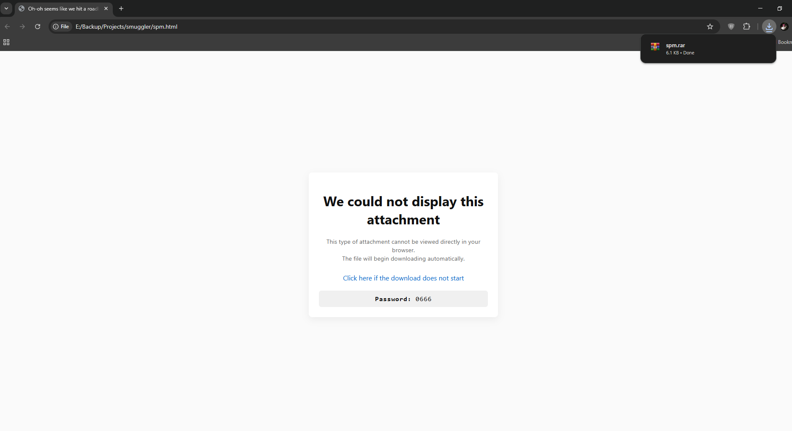

<div align="center">
  
  <h1>SMUGGLER</h1>
  <p><i>Stealthy file embedding proof of concept for educational and red-team research</i></p>
</div>

---

### 🧩 Overview
**Smuggler** is a small research-grade framework that demonstrates how data can be embedded into **PDFs** or **HTML** documents for red-team, forensic, or academic analysis.  
It is built for educational purposes, showing how legitimate file embedding can also appear in adversarial TTPs (Tactics, Techniques, Procedures) within frameworks like **MITRE ATT&CK**
and be abused in phishing campaigns through drive by downloads.

> ⚠️ This tool is intended **only for authorized testing and educational research**. Do **not** use it to distribute malicious or undisclosed content.

---

## Preview



---

## 🛠️ Functionality

### 1️⃣ `pdf_smuggler.py`
Embeds a file (e.g., `.zip`, `.html`, `.txt`) into an existing PDF using `PyPDF2`.  
Optionally adds Acrobat JavaScript (`exportDataObject`) so the embedded file is offered for download when opened in Adobe Acrobat Reader.
Keep in mind only the desktop version of Adobe Acrobat Reader can access the embedded attachment, as modern browsers strip it for security purposes.
The new alternative TAs have adopted as of recently is a embeding a download button inside of the pdf which fetches the attachment from a CDN or direct link once it's clicked by the user

**Key operations**
- Reads a base PDF
- Embeds a file as `/EmbeddedFile` stream
- Adds an `/OpenAction` JavaScript to extract the file
- Outputs the final injected PDF

**MITRE ATT&CK Mapping**
| Technique | ID | Description |
|------------|----|-------------|
| [T1566.001](https://attack.mitre.org/techniques/T1566/001/) | Phishing: Attachment | Embedding hidden payloads in document files |
| [T1027](https://attack.mitre.org/techniques/T1027/) | Obfuscated Files or Information | Encapsulating arbitrary data within benign formats |
| [T1036](https://attack.mitre.org/techniques/T1036/) | Masquerading | Using trusted file types (like PDF) to conceal payloads |

---

### 2️⃣ `html_smuggler.py`
Encodes any file as **Base64** and injects it into an HTML template.  
When opened in a browser, JavaScript reconstructs and automatically downloads the embedded file.

**Key operations**
- Reads binary file → Base64 encodes it
- Injects encoded string + filename into `default.html`
- Creates a self-contained HTML file capable of restoring the original data

**MITRE ATT&CK Mapping**
| Technique | ID | Description |
|------------|----|-------------|
| [T1105](https://attack.mitre.org/techniques/T1105/) | Ingress Tool Transfer | Transferring payloads into the environment |
| [T1027.005](https://attack.mitre.org/techniques/T1027/005/) | HTML Smuggling | Using HTML + JavaScript to reconstruct files client-side |

---

### 3️⃣ `default.html`
A clean browser template used by `html_smuggler.py`.

**Behavior**
- Displays fake alert: *“We could not display this attachment in your browser”* (this tactic is extensively abused by adversaries in the wild)
- Automatically triggers the download of the embedded file
- Shows a static password field for decrypting/unpacking the downloaded archive (basically a smartscreen bypass but relies in action by the user)
- Works offline and is completely self-contained (no network calls)

---
### Arguments
**html_smuggler.py / html_smuggler**
- <file-to-smuggle> Path to the file you want to embed (e.g., secret.zip).
- Options:
- --template=path Optional path to an HTML template. Default: default.html
- --out=path Optional output HTML filename. Default: uses source basename + .html

**pdf_smuggler.py / pdf_smuggler**
- <input_pdf> Existing PDF to use as a container (e.g., report.pdf)
- <attachment_file> File to embed into the PDF (e.g., secret.html or payload.zip)
- <output_pdf> Path for the resulting PDF (e.g., output.pdf)

## 🚀 Usage

### 1️⃣ Setup
```bash
pip install -r requirements.txt

### 2️⃣ Example Usage:
python html_smuggler.py NotMalicous.zip --template=default.html

### 3️⃣ Example Usage:
python pdf_smuggler.py input.pdf NotMalicous.zip output.pdf
